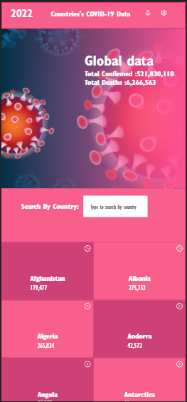
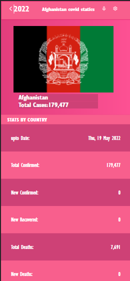

# Covid-Tracker


> This is a Covid-tracker website, that displays Covid-19 statistics for all countries arround the world!
>  

## Live Demo

## Setup

### Clone this repository

```bash
$ git clone git@github.com:sediqullahbadakhsh/covid-tracker.git
$ cd covid-tracker
```

### Run project

```bash
$ npm install
$ npm run start # this will make webpack watching for your changes in code
```

## Built With

- React
- Redux
- Webpack
- JavaScript
- CSS

## Authors

👤 **Sediqullah Badakhsh** -[Github](https://github.com/sediqullahbadakhsh) -[LinkedIn](https://www.linkedin.com/in/sediqullah)

## 🤝 Contributing

Contributions, issues, and feature requests are welcome!

Feel free to check the [issues page](https://github.com/sediqullahbadakhsh/covid-tracker/issues).

## Show your support

Give a ⭐️ if you like this project!

## Appreciation and Credits

I would like thanks and give credits to [Nelson Sakwa on Behance](https://www.behance.net/sakwadesignstudio). For wonderful template on [Behance](<https://www.behance.net/gallery/31579789/Ballhead-App-(Free-PSDs)>).

## 📝 License
